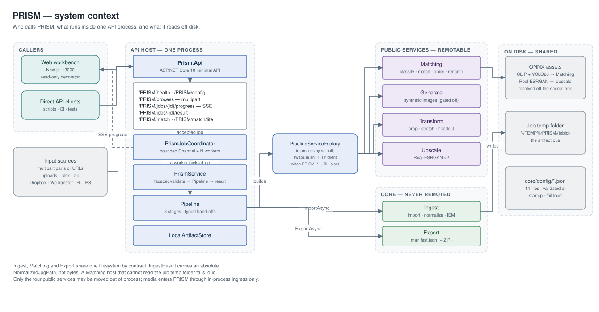
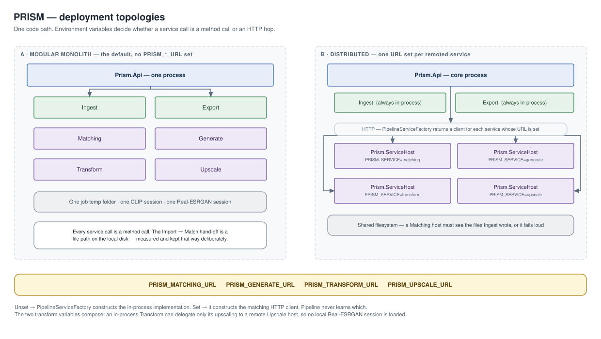
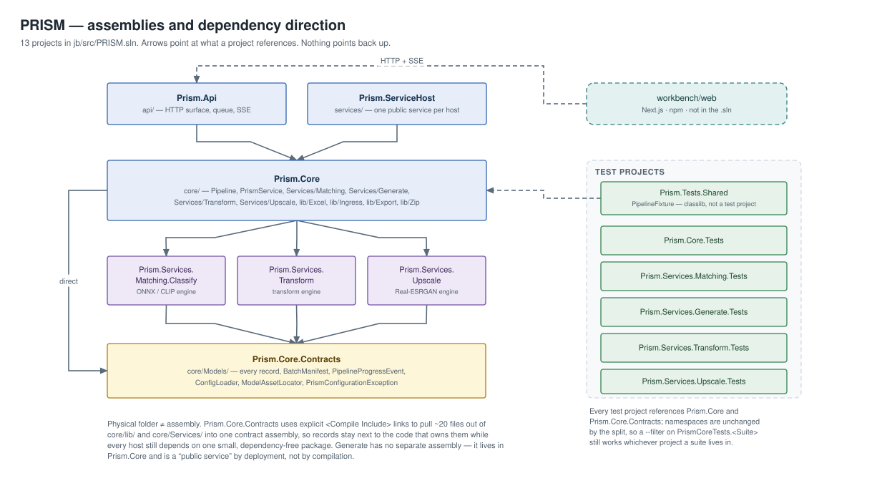
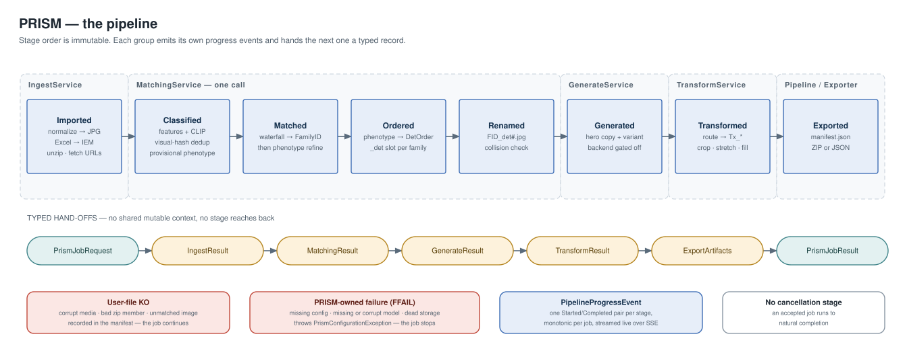
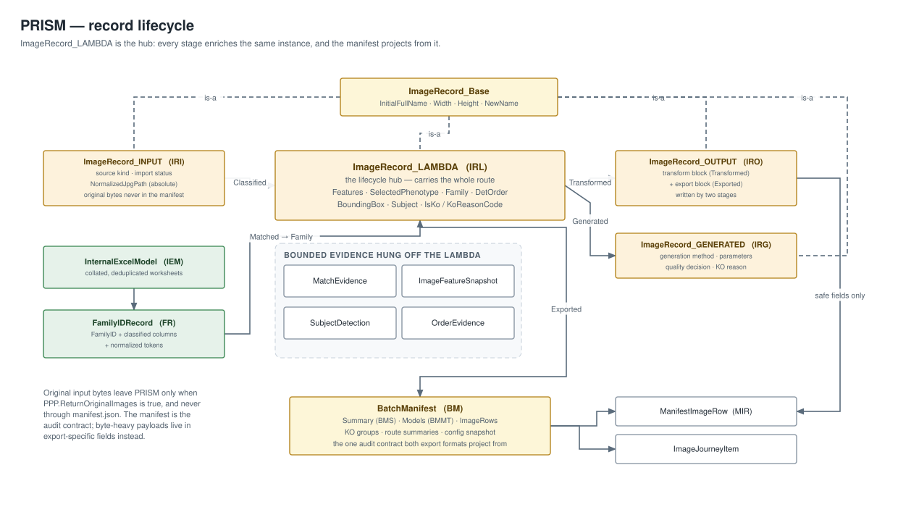
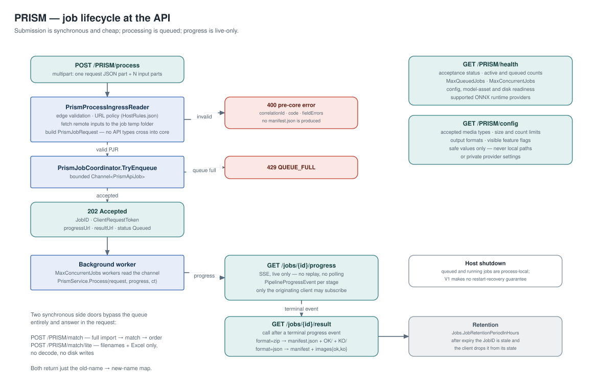
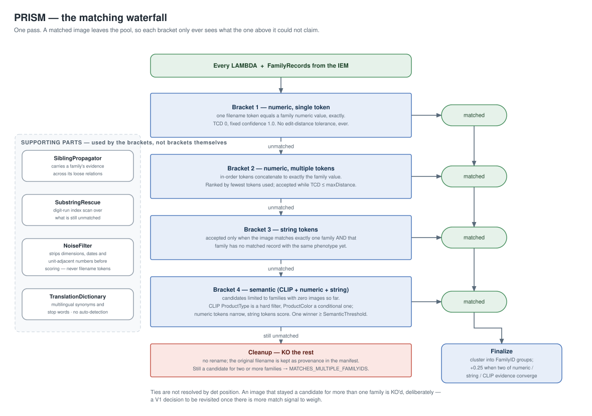
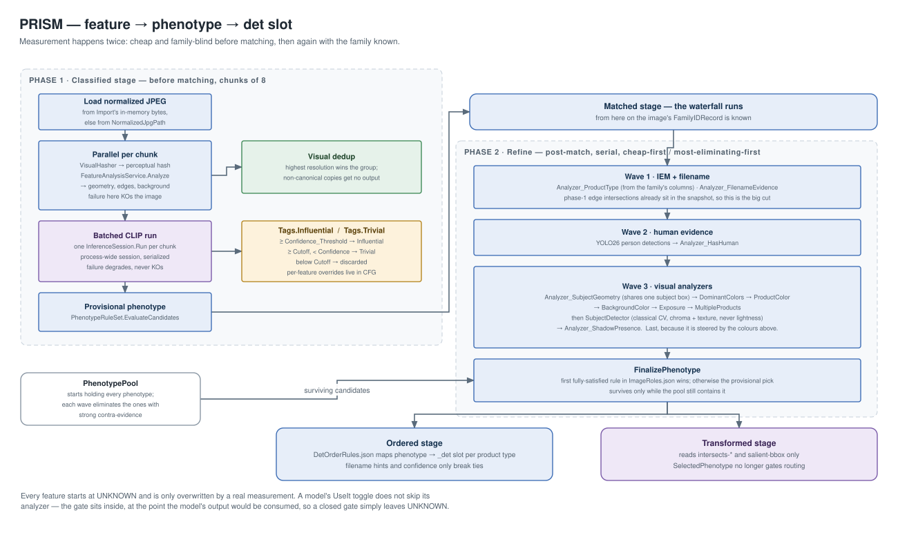
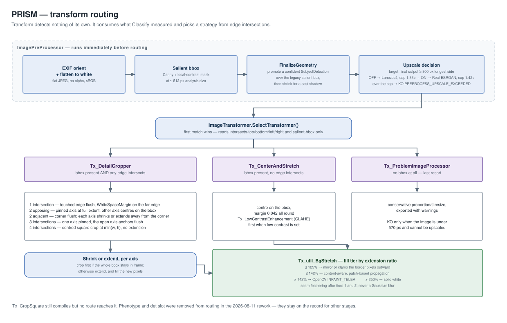

# PRISM — Architecture

*Abbreviations: [`../GLOSSARY.md`](../GLOSSARY.md). Task-to-document map: [`../PRISM-index.md`](../PRISM-index.md).*

This is the overview: what PRISM is, how it is put together, and why the pieces sit where they do.
It is deliberately broad and shallow. Every section ends with a pointer to the deep-dive document
that owns the detail, and those documents remain the source of truth if the two ever disagree.

Diagrams are `.drawio.svg` — they render as pictures anywhere and open as fully editable diagrams in
draw.io. See [`_src/README.md`](_src/README.md).

---

## Contents

1. [What PRISM is](#1-what-prism-is)
2. [The shape of the system](#2-the-shape-of-the-system)
3. [Deployment](#3-deployment)
4. [Assemblies and source layout](#4-assemblies-and-source-layout)
5. [The pipeline](#5-the-pipeline)
6. [The data model](#6-the-data-model)
7. [Job lifecycle at the API](#7-job-lifecycle-at-the-api)
8. [Three deep dives](#8-three-deep-dives)
9. [Cross-cutting rules](#9-cross-cutting-rules)
10. [Conventions that shape the code](#10-conventions-that-shape-the-code)
11. [Testing](#11-testing)
12. [Current state and known gaps](#12-current-state-and-known-gaps)
13. [Where to read next](#13-where-to-read-next)

---

## 1. What PRISM is

PRISM renames and transforms product images using data from supplier Excel workbooks.

A job arrives as a **batch**: images in any combination of loose files, folders, ZIPs and remote
URLs, plus at least one `.xlsx`. PRISM works out which product family each image belongs to, puts
each family's images in a defined order, renames them to `FamilyID_det#.jpg`, transforms them to a
consistent presentation, and returns them with a `manifest.json` that accounts for every input.

| | |
|---|---|
| **Users** | junior, non-technical admin staff; roughly 250 concurrent |
| **Runtime** | local servers. A GPU is a bonus, never a requirement — CPU-only is fully supported |
| **Scale** | up to 10 000 images per batch, 250 MB per image file; a heavy day is ~10k images + 2 workbooks |
| **Stack** | C# / .NET (ASP.NET Core 10), ONNX Runtime, OpenCvSharp, ImageSharp; Next.js workbench |

Two ideas explain most of the design.

**The core is one unit.** Ingress → matching → export is always co-located in one process on one
filesystem. Not for convenience — it is a contract. The Import→Match hand-off is a file path on the
local disk, and that was measured and chosen over carrying bytes or decoded images in memory.

**Everything visual is a feature.** Transform, Generate and Upscale layer on top of the core and are
the only parts that legitimately vary per deployment or run out of process.

> Detail: [`../PRISM-overview.md`](../PRISM-overview.md)

---

## 2. The shape of the system



One `Prism.Api` process holds everything: the HTTP surface, the job queue, the `PrismService` facade,
the `Pipeline`, and — by default — every service the pipeline calls.

The seam that matters is `PipelineServiceFactory`. It returns a `PipelineServices` record holding one
implementation per service. Each member is either the in-process class or an HTTP client to a remote
host, chosen from an environment variable. `Pipeline` holds interfaces and never learns which it got:

```csharp
public sealed record PipelineServices(
    IIngestService Ingest,
    IMatchingService Matching,
    IGenerateService Generate,
    ITransformService Transform,
    IArtifactStore ArtifactStore);
```

Three things sit outside the process, all on local disk: the ONNX model assets, the per-job temp
folder, and the config JSON. None of them is a network service, and there is no cloud storage
anywhere in the design.

---

## 3. Deployment



There is one code path and two shapes.

**Modular monolith (the default).** No `PRISM_*_URL` set. Every service is a method call. One temp
folder, one CLIP session, one Real-ESRGAN session.

**Distributed.** Setting a URL swaps that one service for its HTTP client. `Prism.ServiceHost` hosts
the public services; `PRISM_SERVICE=matching|generate|transform|upscale` narrows a host to one
service, and a single-service host loads only the resources it serves — a transform host never loads
CLIP, a matching host never fail-fasts on the Real-ESRGAN asset.

| Variable | Swaps in |
|---|---|
| `PRISM_MATCHING_URL` | `HttpMatchingService` |
| `PRISM_GENERATE_URL` | `HttpGenerateService` |
| `PRISM_TRANSFORM_URL` | `HttpTransformService` |
| `PRISM_UPSCALE_URL` | `HttpUpscaleService` — an *in-process* Transform delegating only its upscaling |

Two constraints are hard:

- **Ingest is never a service.** Media enters PRISM only through in-process ingress, because ingress
  is also what attaches Excel/IEM context to the media for everything downstream.
- **A Matching host must share Ingest's filesystem.** `MatchingService.MatchAsync` checks the job
  temp folder exists and throws with an explicit co-deployment message if not, rather than KO-ing
  every image with misleading per-image decode errors.

> Detail: [`../PRISM-io-import.md`](../PRISM-io-import.md) → "Co-Deployment Contract"

---

## 4. Assemblies and source layout



Thirteen projects in `jb/src/PRISM.sln`, plus the npm workbench which is not in the solution.

| Project | Path | Owns |
|---|---|---|
| `Prism.Core.Contracts` | `core/Models/` | every record, `BatchManifest`, `PipelineProgressEvent`, `ConfigLoader`, `ModelAssetLocator` |
| `Prism.Core` | `core/` | `Pipeline`, `PrismService`, all `Services/` and `lib/` |
| `Prism.Services.Matching.Classify` | `core/Services/Matching/Classify/` | ONNX / CLIP engine |
| `Prism.Services.Transform` | `core/Services/Transform/Engine/` | transform engine |
| `Prism.Services.Upscale` | `core/Services/Upscale/Engine/` | Real-ESRGAN engine |
| `Prism.Api` | `api/` | HTTP contracts, validation, queue, SSE |
| `Prism.ServiceHost` | `services/` | standalone per-service HTTP host |
| `Prism.Tests.Shared` | `tests/` | `PipelineFixture` — a classlib, not a test project |
| 5 × `*.Tests` | `tests/` | split along public-service boundaries |

**Physical folder ≠ assembly.** `Prism.Core.Contracts` sets `EnableDefaultCompileItems=false` and
uses explicit `<Compile Include>` links to pull ~20 files out of `core/lib/` and `core/Services/`
into one contract assembly. So `FamilyIDRecord.cs` lives next to the Excel code that produces it and
`MatchEvidence.cs` next to the matchers, while every host still depends on one small,
dependency-free package. Namespaces follow the assembly, not the folder: contract types are always
`Prism.Contracts`.

`Generate` has no assembly of its own. It is a "public service" by deployment, not by compilation.

Inside `core/`, the split is by *what a thing is*:

| Folder | Namespace | |
|---|---|---|
| `Services/Matching/` | `Prism.Services.Matching` | `Match/`, `Order/`, `Classify/`, `Analyzers/` |
| `Services/Transform/`, `Generate/`, `Upscale/` | `Prism.Services.*` | one self-contained folder per service; a separable engine sits in `Engine/` |
| `lib/Excel/`, `Ingress/`, `Export/`, `Zip/`, `ImageNGP/` | `Prism.Lib.*` | support libraries, not services |
| `Models/` | `Prism.Contracts` | records |
| `Services/` root, `Services/Http/` | `Prism.Core` | composition glue: interfaces, HTTP clients, `PipelineServiceFactory` |

---

## 5. The pipeline



```
Imported → Classified → Matched → Ordered → Renamed → Generated → Transformed → Exported
```

**The order is immutable.** `Pipeline.StageOrder` is the single source of truth and the Export
manifest builder reads it.

`PrismService.Process` reads like the route it runs, because that is the rule for the file:

```csharp
IngestResult    normalizedImagesAndFamilies = await this.Import(request, progress, ct);
MatchingResult  matchedImages               = await this.Match(normalizedImagesAndFamilies, progress, ct);
(var matchedWithGenerations, var generated) = await this.GenerateSupplementalImages(matchedImages, progress, ct);
TransformResult transformedImages           = await this.TransformImages(matchedWithGenerations, progress, ct);
ExportArtifacts manifestAndZip              = await this.Export(transformedImages, generated, request, progress, ct);
```

Each step hands the next a typed record. **There is no shared mutable context and no stage reaches
backwards.** That is what makes the service seam in §3 possible at all — a stage boundary is already
a serializable value, so putting HTTP across it changes nothing about the code on either side.

| Stage | Runs in | Produces |
|---|---|---|
| **Imported** | `IngestService` | normalized JPGs on the job temp folder + `FamilyIDRecord`s from Excel |
| **Classified** | `MatchingService` | per-image features, CLIP tags, visual-hash dedup, a provisional phenotype |
| **Matched** | `MatchingService` | one FamilyID per image via the waterfall, then phenotype refinement |
| **Ordered** | `MatchingService` | a `_det` slot per image inside its family |
| **Renamed** | `MatchingService` | `FamilyID_det#.jpg`, with collision checking |
| **Generated** | `GenerateService` | supplemental images for thin families — *backend gated off today* |
| **Transformed** | `TransformService` | one `Tx_*` strategy applied per image |
| **Exported** | `Pipeline` / `Exporter` | `manifest.json`, and a ZIP when asked for |

Four stages collapse into one `MatchingService.MatchAsync` call. That is not a layering accident:
Ordered needs the phenotype, the phenotype refinement needs the matched family, and the match needs
the classification. They share one decode of the image and one set of loaded models.

Export is assembled by `Pipeline` directly rather than by a service, because it is core.

### Stage notes

**Imported.** Media kind is triaged from the first 16 bytes, not the extension. Everything supported
— including PDF and multi-page TIFF — is flattened onto white and re-encoded as JPEG, with EXIF
orientation applied. An already-conforming JPEG takes a metadata-only fast path and is copied rather
than re-encoded. Both image loops run `Parallel.ForEach` capped at `Environment.ProcessorCount`;
IEM construction stays sequential because `ModelBuilder` is not thread-safe.

**Classified.** Chunks of 8: decode, perceptual hash and feature analysis run parallel per chunk,
then the whole chunk classifies in one batched CLIP `Run`. CLIP failure *degrades* — matching keys
off filename tokens and must still happen — while feature-analysis failure KOs the image.

**Matched.** See §8.1.

**Ordered.** `ImageOrderer` maps phenotype → `_det` slot per product type via `DetOrderRules.json`.
Filename hints and confidence only ever break ties; they cannot assign a slot.

**Renamed.** The stem is always the matched FamilyID. Output names are sanitized against an allowlist
and reserved before export; a collision KOs the whole affected family rather than guessing.

**Generated.** `GenerationBackendAvailable()` returns `false`. The decision shell runs, qualified
families receive `GenerationRouteState.Gated`, and no inference happens.

**Transformed.** See §8.3.

**Exported.** One canonical `BatchManifest`; ZIP and JSON are two projections of it, and they must
agree field for field.

> Detail: [`../PRISM-pipeline-core.md`](../PRISM-pipeline-core.md), [`../PRISM-io-import.md`](../PRISM-io-import.md), [`../PRISM-order-rename.md`](../PRISM-order-rename.md)

---

## 6. The data model



`ImageRecord_LAMBDA` is the hub. One instance per image carries the whole route — features,
phenotype, family, det order, geometry, KO state — and every stage enriches the same object.
`ImageRecord_OUTPUT` is written by two stages: Transform creates it and fills the transform block,
Export adds the export block and re-copies the identity fields, because det-order compaction may have
renumbered `_det` in between.

| Record | Abbr | |
|---|---|---|
| `ImageRecord_INPUT` | IRI | import state, source kind, `NormalizedJpgPath` |
| `ImageRecord_LAMBDA` | IRL | the lifecycle hub |
| `ImageRecord_OUTPUT` | IRO | transform block + export block |
| `ImageRecord_GENERATED` | IRG | generation details for synthetic children |
| `FamilyIDRecord` | FR | one catalog entity from the IEM |
| `BatchManifest` | BM | the audit contract both exports project from |
| `MatchEvidence` | ME | bounded, safe explanation of one match decision |

Two rules keep the manifest trustworthy:

- **Original input bytes never appear in `manifest.json`**, and leave PRISM at all only when
  `PPP.ReturnOriginalImages` is true — and then in result-specific fields.
- **Evidence is bounded.** `MatchEvidence`, `OrderEvidence` and the feature snapshot carry enough to
  reconstruct a decision, not enough to blow up the payload.

> Detail: [`../PRISM-models.md`](../PRISM-models.md)

---

## 7. Job lifecycle at the API



| Route | |
|---|---|
| `GET /PRISM/health` | acceptance status, active/queued counts, config + model + disk readiness, runtime providers |
| `GET /PRISM/config` | accepted media types, limits, output formats, visible feature flags — safe values only |
| `POST /PRISM/process` | multipart job ingress → `202 Accepted` with `JobID`, `progressUrl`, `resultUrl` |
| `GET /PRISM/jobs/{id}/progress` | SSE, live only |
| `GET /PRISM/jobs/{id}/result` | ZIP or JSON, per the job's `format` |
| `GET /PRISM/jobs` | job summaries |
| `POST /PRISM/match` | synchronous: import → match → order, returns the filename map only |
| `POST /PRISM/match/lite` | synchronous: filenames + Excel only, no decode, no disk writes |

Submission is cheap and synchronous; processing is queued. `PrismProcessIngressReader` does edge
validation, applies URL policy from `HostRules.json`, fetches remote inputs into the job temp folder,
and builds a `PrismJobRequest`. **No API type crosses into core** — the PJR must not expose raw
multipart objects or platform link objects.

`PrismJobCoordinator` is a bounded `Channel<PrismApiJob>` with a fixed set of background workers
(shipped config: `MaxQueuedJobs` 100, `MaxConcurrentJobs` 5, retention 24 h). The queue carries job
references and metadata, never image bytes. A full queue is rejected *before* job creation, so no
`manifest.json` is produced for it.

**There is no cancellation stage.** An accepted job runs to natural completion; the
`CancellationToken` threaded through the pipeline is a host-shutdown token, not a user cancel. SSE is
live-only — no replay for late subscribers or reconnects — and queued/running jobs are process-local
in V1, with no restart-recovery guarantee.

> Detail: [`../PRISM-api.md`](../PRISM-api.md)

---

## 8. Three deep dives

### 8.1 Matching



`ImageMatcher` runs one pass over four brackets. A matched image leaves the pool immediately, so each
bracket only sees what the one above could not claim.

The spine is **numeric exactness**. Brackets 1 and 2 require the filename token — or the in-order
concatenation of tokens — to *equal* a family's numeric value. There is no edit-distance tolerance on
numbers at all; the only scoring axis is TCD, how many tokens it took. Strings are where tolerance
lives, and even there it is narrow: a bounded Levenshtein ≤ 1 against categorical columns only, both
sides ≥ 4 characters, scored below an exact hit.

Bracket 4 is the only semantic one, and it is a filter before it is a score: CLIP `ProductType` is a
hard filter, `ProductColor` a conditional one, numeric tokens narrow the pool, and string tokens pick
the winner — which must be unique and clear `SemanticThreshold`.

`ClipLabelEnricher` is **not a matcher** and never assigns a FamilyID.

An image still a candidate for two or more families after every bracket is KO'd with
`MATCHES_MULTIPLE_FAMILYIDS`. No det-position comparison is used to break that tie. That is an
explicit V1 decision, not an omission.

> Detail: [`../PRISM-match.md`](../PRISM-match.md)

### 8.2 Feature → phenotype → det slot



Measurement happens twice, on purpose.

**Before matching**, cheap and family-blind: geometry, edges, background, the perceptual hash, and
CLIP tags split into `Tags.Influential` and `Tags.Trivial` by confidence.

**After matching**, in `ImageFeatureAnalyzer.Refine`, with the family known. A `PhenotypePool` starts
holding every phenotype and each wave eliminates the ones with strong contra-evidence, cheapest and
most-eliminating first: IEM + filename evidence, then YOLO person detections, then the visual
analyzers sharing one subject box.

`SubjectDetector` runs last in wave 3 and, critically, *before* the phenotype is finalized — a
feature measured after the rules evaluate would always read `UNKNOWN`. It is classical CV, no ONNX,
and its defining invariant is that **lightness is never a detection criterion**: a cast shadow is a
near-pure lightness change, so detection keys on chroma (distance from a least-squares background
*plane*) and texture (local σ after a high-pass). White-on-white is caught by texture alone.

The governing rule for the whole chain: **every feature starts at `UNKNOWN` and is only overwritten
by a real measurement.** A model's `UseIt` toggle never skips an analyzer and never adds a parallel
code path — the gate sits inside the analyzer, where the model's output would be consumed, so a
closed gate simply leaves `UNKNOWN`.

Transform reads only `intersects-*` and `salient-bbox` from all of this. Ordering is what consumes
the phenotype.

> Detail: [`../PRISM-classify.md`](../PRISM-classify.md), [`../ImageNGP/`](../ImageNGP/)

### 8.3 Transform



**Transform performs no detection of its own.** It consumes what Classify measured.

`ImagePreProcessor` settles the geometry first — promoting a confident `SubjectDetection` over the
legacy salient box, then trimming for a cast shadow — and only then makes the upscale decision,
because both steps change the box the crop runs on. The upscale bar is the **final output image**
(≥ 800 px on the longest side), computed exactly by `FinalOutputSize`, which the crop transform sizes
against too so the two cannot drift apart. `AllowEsrganUpscale` then picks only the resampler and the
cap: Lanczos4 at 1.33× off, Real-ESRGAN at 1.42× on.

Routing is edge-intersection count only. `SelectedPhenotype` and det slot were removed from it in the
2026-08-11 rework; they stay on the record for other stages.

| Condition | Strategy |
|---|---|
| bbox present, any edge intersects | `Tx_DetailCropper`, dispatching on the exact 1 / 2-opposite / 2-adjacent / 3 / 4 pattern |
| bbox present, no edge intersects | `Tx_CenterAndStretch` |
| no bbox | `Tx_ProblemImageProcessor` — a last resort, not a gate |

An axis is cropped when the whole bbox stays in frame and extended otherwise, with the fill method
tiered by extension ratio (mirror/clamp → content-aware → `INPAINT_TELEA` → solid white). Gaussian
blur is never a fill method.

> Detail: [`../PRISM-transform-generate.md`](../PRISM-transform-generate.md)

---

## 9. Cross-cutting rules

### 9.1 Configuration — no shadow defaults

Every parameter lives in a JSON file next to the code that uses it. There are no magic values inline
and, more importantly, **no in-code fallbacks**.

Every PRISM config class carries no property initializers: every property is `required` and loads
with required-member enforcement. A missing or misspelled key fails at load time as
`PrismConfigurationException`, naming the file, the section and the key. The rule extends to
constructor parameters that thread config-sourced tuning values — no C#-level defaults on those
either, so a missing value is a compile error or a load-time throw, never a silent fallback.

Loading is two phases:

1. **Load.** `ConfigLoader.Section<T>(file, section)` deserializes one section independently. Each
   section class implements `IValidatableConfig`; `ConfigLoader` calls `Validate()` immediately.
2. **Bundle.** Loaded sections compose into a plain parameter object (`TransformParameters`,
   `AnalyzerParameters`) via `FromConfig()`. Those own no parsing and no validation.

Config is therefore **injected, not fetched** — a consumer receives its parameters and never reaches
for the filesystem. The one deliberate exception is the two fixed-signature webservice entry points
(`Tx_util_BgStretch.Process`, `Tx_LowContrastEnhancement.Process`) which have no parameter to receive
config through.

Everything resolves through `ConfigLoader.RequireFile` / `Section<T>` / `Root<T>`, and model assets
through `ModelAssetLocator.Find`. `PrismConfigLocator` and `ConfigCache` are deleted — **do not
reintroduce a config cache**; it was measured (all config JSON totals 62 KB, every load site fires
once per job) and removed as pure indirection.

All 14 runtime config files live in `jb/src/core/config/` and are copied to output by `Prism.Core.csproj`.

`PrismConfigurationException` derives from `InvalidOperationException`, so existing
`catch (InvalidOperationException)` still catches it — but `Assert.Throws<T>` is an *exact* type
match, so tests must assert the derived type.

### 9.2 Model runtime

One policy for every component that runs a model — CLIP, YOLO, Real-ESRGAN, and anything added later.

- **One package, one version.** `Microsoft.ML.OnnxRuntime.DirectML` is pinned once in
  `jb/src/Directory.Packages.props` under Central Package Management. Consuming `.csproj` files carry
  no `Version` attribute.
- **One construction path.** `OnnxSessionFactory.Create(modelPath)` is the only place allowed to
  build `SessionOptions` or an `InferenceSession`. It is `internal` and file-linked into every
  project that loads a model.
- **CPU is the baseline; DirectML is used when a hardware adapter is present.** GPU absence never
  fails a job and never disables a stage.
- **No algorithm switching on GPU presence.** A component must never gate *loading its model* on a
  GPU probe. The former Lanczos-only CPU upscaler and its router are deleted.
- **A missing or corrupt model asset is a loud startup failure** — unless that model's `UseIt`
  toggle is off, which is the one config-declared exception. Asset validation follows the toggle.

The CLIP `InferenceSession` is a process-wide singleton held by `MatchingService`; all `Run()` calls
serialize through a lock, because the DML provider is not thread-safe for concurrent calls.
`ClassificationService` is per-job but borrows the shared classifier and does not dispose it.

### 9.3 Failure policy

Exactly two failure classes, and they behave differently on purpose.

| | **User-file KO** | **PRISM-owned failure (FFAIL)** |
|---|---|---|
| Examples | corrupt or unsupported media, bad ZIP member, Excel row with an invalid PK, unmatched image, transform that produced KO | missing or invalid config, missing/corrupt/incompatible model, invalid internal thresholds, unavailable storage, exporter failure |
| Effect | recorded in the manifest; **the job continues** while valid work remains | **the job stops** as `Failed` |
| Never | converted into a job failure | converted into per-image KO |

FFAIL should happen before expensive work wherever possible — which is why `PrismApiConfiguration.Load()`
validates all config and every required model asset at API startup.

### 9.4 The artifact bus

The job temp folder is the bus between stages. `IngestResult` carries `NormalizedJpgPath` as an
**absolute local path**, not bytes.

This was measured, not assumed. On SPACINI29 (86 JPEGs, ~486 MB, 156.5 s job wall): re-reading the
normalized files costs 1.8 s summed (~1.2% counted serially, well under 0.5% at the real 8-wide
parallelism), and decoding them 21.3 s summed CPU — at a cost of ~16 MB per image of unbounded RAM
if carried. Neither saving justified an unbounded Import→Match memory spike. Do not re-propose an
in-memory carry without new evidence that read/decode has become a dominant cost.

### 9.5 Concurrency

| Where | Shape |
|---|---|
| API jobs | `MaxConcurrentJobs` background workers over a bounded channel |
| Import normalization | `Parallel.ForEach`, capped at `Environment.ProcessorCount`; results in `ConcurrentBag` |
| Classify | chunks of 8; `Parallel.For` at `min(ProcessorCount, 8)`, then one batched CLIP `Run` per chunk |
| CLIP inference | serialized process-wide through `MatchingService._clipLock` |
| Phenotype refinement | **serial** — and so `SubjectDetector` is serial too |
| Excel / IEM build | sequential; `ModelBuilder` is not thread-safe |

Order carries no meaning between images downstream — `Exporter` and matching correlate by
`InitialFullName`, never by list position — which is what makes the unordered parallel accumulation
safe. Ordering *within* a family is decided explicitly by `ImageOrderer`, whose final tie-breakers
are a filename ordinal and then the stable import source index, so upstream reordering cannot change
an outcome.

### 9.6 Progress

`PipelineProgressEvent` carries `JobID`, stage name, current item, completed/total counts, severity,
a safe message and a timestamp. Events are monotonic for one job. Queue and completion status events
may appear around the route-stage events. The workbench renders them live; there is no polling and no
WebSocket.

---

## 10. Conventions that shape the code

These are style rules with architectural consequences, not formatting preferences.

- **One type per file**, named after the type. Never a second type inside an existing file. This is
  why `core/` has many small files and why moving a type between assemblies is a `<Compile Include>`
  edit rather than a refactor.
- **`Pipeline.cs` and `PrismService.cs` contain management code only.** No inline logic. Each stage
  delegates to a dedicated class. The main flow must read like a recipe: `Initialize()` acquires,
  `Process()`/`Run()` expresses the workflow, named helpers do the steps.
- **Every external resource** (`InferenceSession`, `Mat`) is acquired in `Initialize()`, released in
  `Dispose()`, and held by a class that implements `IDisposable`. Lifecycle:
  validate → initialize → try/catch/finally → release → return a structured result.
- **ONNX:** name every tensor input/output with a string constant; state the expected input shape and
  normalization in a comment above tensor construction; one method per preprocessing step.
- **OpenCV:** every `Mat` name reflects its state; colour space (BGR/RGB) is stated at every image
  boundary; intermediates are disposed.
- **Comments: class-level `/// <summary>` only.** No XML docs on methods or properties. Inline
  comments only for what the code cannot express — an ONNX quirk, an empirical threshold, why a
  workaround exists.
- **Magic numbers:** a named `private const` at the point of use is the default. A bare literal
  behind a tightly-scoped `#pragma warning disable S109` is reserved for two cases: file-format
  headers that will never change, and structural math obvious from context (a `/2` midpoint). Genuinely
  tunable values go to config instead.

---

## 11. Testing

Five xUnit projects under `jb/src/tests/`, split along public-service boundaries, plus
`Prism.Tests.Shared` holding `PipelineFixture`. Namespaces were unchanged by the split, so a
`--filter "FullyQualifiedName~PrismCoreTests.<Suite>"` still works whichever project a suite lives in.

```
dotnet test jb/src/PRISM.sln -m:1          # everything, 529 tests serialized
```

**`-m:1` is required, not optional.** Run in parallel, the test projects contend for the GPU and the
job temp folder: `Prism.Services.Matching.Tests` does ~95 s of OpenCV subject detection plus a shared
DirectML YOLO session while `Prism.Core.Tests`'s `PipelineFixture` builds and disposes a whole
`PrismService` (146 MB CLIP + 37 MB YOLO). The signature of the failure is all seven
`PipelineIntegrationTests.CiMini_*` failing in under 1 ms each while every project passes on its own.
`ci.yml` already passes `-m:1`.

End-to-end validation additionally runs via `pwsh test/ci/Invoke-CiPipeline.ps1`.

> Detail: [`../PRISM-testing.md`](../PRISM-testing.md)

---

## 12. Current state and known gaps

The architecture is complete; several stages are deliberately partial. Reading the code without this
list makes the gaps look like bugs.

| Area | State |
|---|---|
| **Generation** | `GenerationBackendAvailable()` returns `false`. Qualified families get a `Gated` placeholder record; no inference runs. `Models.Generation.UseIt` must stay `false` — flipping it makes `ImageGenerator.Run` skip the placeholder and the family silently produces nothing |
| **Phenotypes** | most per-feature analyzers still return `UNKNOWN`, so `PhenotypeRuleSet.Assign` often returns null and images overflow. Det compaction then yields `det0`-based numbering over filename-hint order rather than true slot semantics. Expected, not an ordering bug |
| **`Tx_CropSquare`** | compiles, but no route reaches it. Kept for a possible repurposing |
| **Cross-bracket ties** | KO'd rather than resolved. A V1 decision to revisit once there is more match signal |
| **Legacy config classes** | `ExcelConfig`, `PrismConfiguration`, `TranslationConfig`, `HostRules`, `ProductTypeMap`, `ImageNGP`, `ImageRoles`, `DetOrderRules`, `ClipPrompts` predate the no-shadow-defaults rule and await a retrofit ticket. New or touched config code follows the rule regardless |
| **Doc/config drift** | `PRISM-classify.md` states `Classification.Confidence_Threshold` is `0.9`; the shipped `Prism_Config.json` has `0.5` plus per-feature overrides. Trust the config file |
| **`Tx_util_HeadCutter`** | the per-image Algorithm B path ships; the anatomy-guided Algorithm A refinement is open |

Open work is tracked in `jb/ticketboard/` (board: `AGENT-TICKETS.md`) and in folder-local
`jbtodo.md` files.

---

## 13. Where to read next

| You are working on | Read |
|---|---|
| `Prism.cs` / `Pipeline.cs` | [`../PRISM-pipeline-core.md`](../PRISM-pipeline-core.md) |
| Import, IO, fetchers, zip | [`../PRISM-io-import.md`](../PRISM-io-import.md) |
| Excel / IEM | [`../PRISM-excel.md`](../PRISM-excel.md) + [`../PRISM-models.md`](../PRISM-models.md) |
| Matchers | [`../PRISM-match.md`](../PRISM-match.md) + [`../PRISM-models.md`](../PRISM-models.md) |
| Classification, ONNX | [`../PRISM-classify.md`](../PRISM-classify.md) |
| Anything that loads a model | [`../PRISM-model-runtime.md`](../PRISM-model-runtime.md) |
| Ordering, rename | [`../PRISM-order-rename.md`](../PRISM-order-rename.md) |
| Transform, generation | [`../PRISM-transform-generate.md`](../PRISM-transform-generate.md) |
| API, SSE | [`../PRISM-api.md`](../PRISM-api.md) |
| Web workbench | [`../PRISM-workbench.md`](../PRISM-workbench.md) |
| Phenotypes, det-order assignment | [`../ImageNGP/`](../ImageNGP/) |
| Tests | [`../PRISM-testing.md`](../PRISM-testing.md) |
| A hang or "the pipeline is stuck" | [`../PRISM-postmortem-T6900-reasoning.md`](../PRISM-postmortem-T6900-reasoning.md) — read the checklist before forming a theory |
